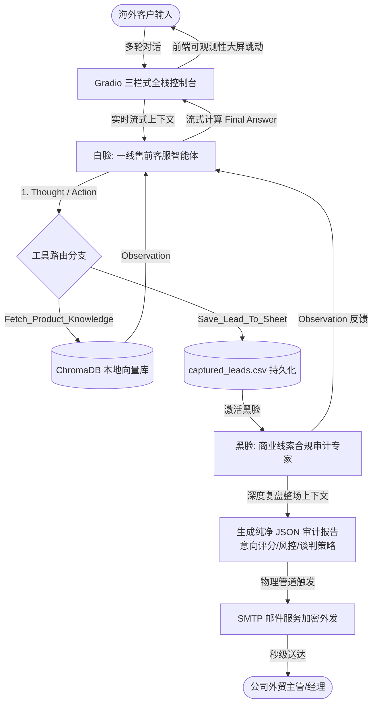

```markdown
# 🌍 Cross-Border Multi-Agent Sales Console (跨境出海多智能体私域获客控制台)

[](https://www.python.org/)
[](https://gradio.app/)
[](https://github.com/chroma-core/chroma)
[]()
[]()

一款基于 **ReAct 架构状态机**、**分布式双智能体协同（Multi-Agent Collaboration）** 与 **ChromaDB 本地向量知识库** 构建的垂直出海领域企业级全栈 AI 运营控制台。系统专门解决跨境电商与 B2B 海外出海引流中，人工客服响应不及时、客户高价值意向线索流失及同行恶意套词风控等真实商业痛点。

---

## ✨ 核心特性 (Key Features)

* **🧠 售前智能体（白脸）**：基于标准的 `Thought -> Action -> Observation -> Final Answer` 推理闭环，动态进行语义理解，智能路由外部工具链。
* **🕵️‍♂️ 审计专家智能体（黑脸）**：当捕获线索时由后台自动触发唤醒。**全量复盘整场上下文**，运用大模型深度刻画客户画像，对客户购买概率进行 `0-100` 动态打分，并进行同行套词风控评级。
* **📬 冲破物理世界的自动化管道**：打通 **SMTP 加密外发管线**。后台审计专家生成的《商业线索分析与谈判破冰策略简报》会在秒级自动化异步外发至公司外贸主管的真实邮箱中。
* **📚 动态 RAG 数据流管道**：支持在网页端一键动态上传 PDF/TXT 产品手册，系统自动在后台执行文本切片（Chunking）、语义嵌入（Embedding）并持久化同步至本地 ChromaDB 向量数据库。
* **📊 实时 FinOps 成本监控**：内置精密的 Token 拦截计算器，秒级清算大模型每一次推理产生的 Input/Output Token 消耗并折算为真实美金成本，展示极强的企业降本增效意识。
* **🔄 异常自我修复机制 (Self-Correction)**：对大模型不稳定的 JSON 输出进行了工程化兜底，当格式解析失败时自动将 traceback 报错回喂给模型进行动态自我修复。

---

## 📐 多智能体协同架构 (Architecture)



---

## 📂 项目规范工程目录 (Directory Structure)

```text
├── .gitignore               # 严密隔离 .env 与向量库本地缓存的安全防火墙
├── .env                     # 存放私密大模型 API Key 及 SMTP 邮箱密码的配置文件
├── requirements.txt         # 声明核心项目依赖 (OpenAI, Gradio, ChromaDB)
├── prompt.py                # 存放一线客服与后台合规专家的分布式提示词大脑
├── init_db.py               # 向量知识库本地持久化初始化脚本
├── main.py                  # 核心 ReAct 流式生成器引擎、多智能体协同调度中心
├── app.py                   # 基于 gr.Blocks 徒手组装的三栏式可视化控制台
├── sales_handbook.txt       # 行业级测试出海网关硬件产品手册
└── captured_leads.csv       # 真实持久化落地、具备 Side Effect 的客户线索数据库

```

---

## 📥 物理执行管线 Showcase 展示

### 1. 本地落地线索数据库 (`captured_leads.csv`)

当海外客户表达留资意向时，系统自动追加写入结构化表格：

```csv
客户姓名/称呼,联系方式,购买意向描述
老张,zhang123456 (微信),新能源车批发商，单次拟采购20台专业版设备，关心多账号防封功能。

```

### 2. 真实送达的主管邮箱简报 (`Email Alert Preview`)

```text
发件人: MIMO-Agent-System <1514723575@qq.com>
收件人: Sales-Manager <1514723575@qq.com>
主题: 🔥 发现高价值出海客户: 老张 (意向分: 95)

========= 🚨 跨境私域 Agent 捕获高价值线索通知 =========
【基础留资信息】
👤 客户称呼: 老张
📱 联系方式: zhang123456 (微信)

【🕵️‍♂️ 后台合规专家 Agent 深度审计报告】
🎯 客户画像: 中型新能源汽车出口供应链海外独立站决策者，具备批量采购话语权。
🔥 意向打分: 95/100 （极高，话术中包含明确账期、订购基数及技术细节质询）
⚠️ 风控评级: 低风险（经整场上下文语义核验，非同行探针套词或恶意调戏）
🎯 核心痛点: 强依赖多账号矩阵控流技术以应对海外风控防封，且关注阶梯批发折扣。
💡 谈判与破冰策略: 建议外贸经理在微信破冰时，首轮切入“提供海外服务器私有化部署免费演示”，并主动递交10台以上85折的行业底价单，以技术护城河迅速转化。
======================================================

```

---

## 🚀 快速开始 (Quick Start)

### 1. 克隆本项目并安装依赖

```bash
git clone [https://github.com/cjx62220-spec/Cross-Border-Sales-Agent.git](https://github.com/cjx62220-spec/Cross-Border-Sales-Agent.git)
cd Cross-Border-Sales-Agent
pip install -r requirements.txt

```

### 2. 配置环境变量

在项目根目录下创建 `.env` 文件，并配齐您的 API 及 SMTP 服务信息：

```env
MIMO_API_KEY=您的专属API_KEY
MIMO_BASE_URL=[https://token-plan-cn.xiaomimimo.com/v1](https://token-plan-cn.xiaomimimo.com/v1)
MIMO_MODEL=mimo-v2.5-pro

# SMTP 自动化邮件外发配置（以QQ邮箱为例）
SMTP_SERVER=smtp.qq.com
SMTP_PORT=465
SENDER_EMAIL=1514723575@qq.com
SENDER_PWD=您的QQ邮箱16位SMTP授权码
RECEIVER_EMAIL=1514723575@qq.com

```

### 3. 初始化向量数据库

```bash
python init_db.py

```

### 4. 启动可视化控制台

```bash
python app.py

```

打开浏览器访问 `http://127.0.0.1:7860` 即可开启全栈智能体运营监控。

---

## 🗺️ 未来路线图 (Roadmap)

* [x] 多智能体（Multi-Agent）后台协同审计管线
* [x] 基于大模型 JSON 格式响应的强约束工具路由
* [x] 物理世界自动化邮件通知（SMTP Authentication）
* [ ] 动态支持 PDF / Word / Markdown 多格式文档批量切片上传
* [ ] 接入海外 WhatsApp Cloud API，实现真实私域通道的双向自动接单响应
* [ ] 引入内存滑动窗口（Sliding Window）与历史摘要算法深度优化大模型上下文成本

```

```