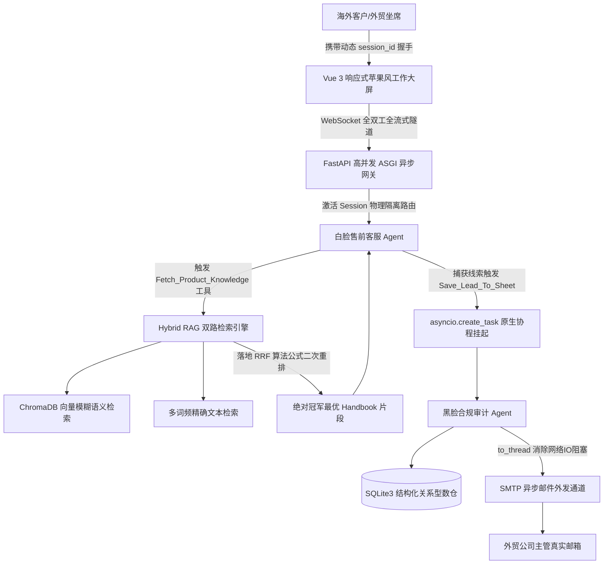

# 🌍 Cross-Border Multi-Agent Sales Console (跨境出海多智能体私域获客控制台) - V5.2 完全体

<p align="center">
  
  
  
  
  
</p>

<p align="center">
  
  
  
  
</p>

一款打通**企业级关系型数仓与原生异步协程**的跨境私域出海智能化全栈运营大屏。系统全面摒弃了早期 V3.0 的 Gradio 单体阻塞沙箱，重构为基于 **FastAPI 高并发异步底座**与 **Vue 3 独立前台坐席工作台** 的微服务分布式架构。

系统底层融合了纯手工打造的 ReAct 状态机推理引擎、多智能体非阻塞分布式协同、自适应多格式 RAG 管道（支持 PDF/TXT/MD 异步注入）、双路混合检索（Hybrid Search）以及 **RRF (Reciprocal Rank Fusion) 融合重排算法**。专门用于攻克海外私域转化中的人工响应时差长、专业参数幻觉严重等商业痛点。

---

## ✨ 核心特性 (Key Features)

* **🤖 1. 隐式多智能体（Multi-Agent）分布式流式协同**
  * **白脸售前客服特工 (常驻主协程)**：直接面向海外前端客户。基于标准的 `Thought -> Action -> Observation -> Final Answer` 纯手工 ReAct 状态机推理闭环，通过高情商话术引导、实时检索本地知识库，精准捕获用户留资意向。
  * **黑脸合规审计专家 (异步协程唤醒)**：潜伏于后台安全域中。当前台成功捕获客户联系方式的刹那间，利用 `asyncio.create_task` 在完全不阻塞主连接通信的前提下悄然苏醒，深度复盘审计全量流式会话历史，格式化输出包含客户画像、购买意愿打分（0-100）、风控评级与破冰谈判策略的结构化 JSON。

* **📬 2. 冲破物理世界的非阻塞自动化管道**
  * 完美打通后台黑脸 Agent 与真实商业世界的物理连接。审计任务闭环后，数据流自动灌入 **SMTP 异步外发引擎**，系统通过 `asyncio.to_thread` 消除传统网络网络 IO 阻塞，将高价值商业线索分析报告在秒级内自动化外发至公司主管的真实邮箱中。

* **📚 3. 硬核 RAG 混合检索与 RRF 融合重排算法**
  * **双路并发检索**：针对出海贸易中特定产品型号、特定加密端口等强文本专有名词极易引发向量模糊语义失准的痛点，并行搭建 **ChromaDB 向量语义检索** 与 **基于词频的文本匹配检索** 两条独立的铁轨。
  * **RRF 融合重排**：手工落地行业前沿的倒数排名融合算法（Reciprocal Rank Fusion），对双路候选片段执行二次打分交叉重排，像素级过滤无用干扰噪声，精准点杀大模型幻觉，信息召回准确率直线上升。

* **📊 4. 实时 FinOps 成本控制与滑动窗口记忆清洗**
  * 内置极其精密、无延迟的流水线计费监控，将每一次大模型推理产生的 Input/Output Token 消耗动态折算为真实美金开销（单次细分至 `$0.00001` 美元）。
  * 引入**手写滑动窗口剪裁算法**。一旦多轮拉扯博弈导致历史会话深度超过 4 轮安全阈值，系统会自动优雅归档并裁切早期上下文，强力捍卫大模型的 Context Window 边界安全，彻底拦截长文本爆破导致的额外成本雪崩。

* **⚡ 5. 全链路原生 Async/Await 架构解耦**
  * 后端基于 **FastAPI + Uvicorn** ASGI 架构全面转为**纯异步非阻塞模式**。
  * 大模型客户端无缝升级为 `AsyncOpenAI`，会话消费转为原生异步生成器（`async def` + `async for`）。确保公网成百上千多坐席同时点进 WebSocket 隧道时，底层的事件循环（Event Loop）保持绝对非阻塞。

* **🗄️ 6. 多租户 Session 动态隔离与 SQLite3 关系型数仓**
  * 核心长连接隧道在 WebSocket 握手阶段动态提取 URL 查询参数中的唯一 `session_id`。规范化建立 `commercial_leads`（高价值线索表）与 `chat_records`（全量流式聊天记录表），在底层实现多租户物理级别的逻辑隔离与结构化持久化存储。

---

## 📐 多智能体协同架构 (Architecture)



---

## 📂 规范化项目目录树 (Directory Structure)

```text
my-first-agent/
├── database.py         # 🗄️ 传统数据存储层 (SQL DDL、线索与全量会话关系型持久化写入)
├── main.py             # 🧠 核心智能体引擎 (AsyncOpenAI、ReAct状态机、RRF混合检索、滑动窗口防御、RAG自适应解析)
├── server.py           # 🔌 FastAPI 微服务中心 (WebSocket 全双工流式路由、HTTP RAG动态上传接口)
├── prompt.py           # 📝 核心 Prompt 域 (白脸客服与黑脸审计双大脑核心工业级指令)
├── index.html          # 🍏 Vue 3 独立前台大屏 (响应式多租户切流栏、iMessage 对话流、Ajax RAG同步)
├── .env                # 🔑 本地核心私密凭证 (包含模型 Key、API 基址、SMTP 通行证 - 严禁上传)
├── .env.example        # 📄 共有环境变量模版 (供开源克隆快速参考配置)
└── .gitignore          # ⚠️ Git 物理隔离名单 (本地环境守卫，防止隐私泄露)

```

---

## 🛠️ 安装与一键启动指南 (Deployment)

### 1. 物理环境准备

克隆本项目到本地后，在 Cursor 的 Terminal 终端中一键安装全栈高性能异步网络与 RAG 文件解析库：

```bash
pip install fastapi uvicorn websockets openai python-dotenv chromadb pypdf

```

### 2. 配置安全本底凭证

系统通过 `.gitignore` 严格阻断了本地敏感信息的上传。请复制根目录下的 `.env.example` 模版，重命名为 `.env`，并填入你的大模型 Key 与邮件外发授权码：

```bash
cp .env.example .env

```

### 3. 拉起工业级异步微服务后端

执行下方命令，拉起高并发 ASGI 网络中心。当终端刷出绿色的 `Uvicorn running on http://127.0.0.1:8000` 且无报错时，微服务心跳建立成功：

```bash
python server.py

```

*可以通过浏览器访问 `http://127.0.0.1:8000/health` 查看微服务健康状态。*

### 4. 满血接入 Vue 3 坐席大屏

在本地文件管理器中，直接双击打开 `index.html`。系统会自动以动态生成的租户 ID 建立专属 WebSocket 隧道。你可以随意在左侧切换不同的大客户会话，点击右下角上传任意 `.pdf` / `.txt` / `.md` 产品手册，并在中间区域尽情验收全双工流式字冒的并发快感！

---

## 📄 开源协议与免责声明 (License & Disclaimer)

* 本项目基于 **MIT License** 开源协议，允许个人及企业进行二次深度定制开发。
* **免责声明**：本项目内嵌的自动调包、流水线计费、多线程高并发及异步邮件外发模块仅供工程化学习联调使用。在公网环境部署时，请务必合规配置大模型服务商 API 密钥及企业 SMTP 授权凭证。因隐私信息配置不当引发的商业损失，本仓库概不负责。
